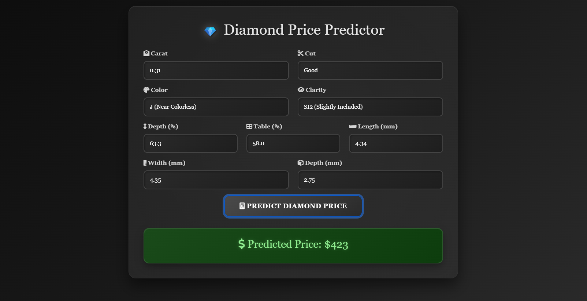

# 💎 Diamond Price Prediction / Elmas Fiyat Tahmini

Bu proje, popüler Diamond veri seti kullanılarak eğitilmiş bir makine öğrenimi modelinin **FastAPI** aracılığıyla bir web uygulaması haline getirilmiş versiyonudur.
Kullanıcı, basit bir web arayüzü üzerinden elmas özelliklerini girerek fiyat tahmini alabilir.

## Örnek Arayüz



## Proje Dosya Yapısı
```
project/
│
├── app.py                     # FastAPI uygulaması
├── Diamond_Model.pkl          # Eğitilmiş makine öğrenimi modeli
├── requirements.txt           # Bağımlılık listesi
│
└── templates/
    └── index.html             # Kullanıcı arayüzü (HTML form)
```

## Kurulum ve Çalıştırma

1) Depoyu Klonlayın (Sadece MLOps klasörünü indirme)
```bash
git clone --no-checkout https://github.com/ensarakbas77/Veri-Bilimi-Makine-Ogrenmesi-100-Gunluk-Kamp.git
cd Veri-Bilimi-Makine-Ogrenmesi-100-Gunluk-Kamp

git sparse-checkout init --cone
git sparse-checkout set MLOps

git checkout main
```

2) Sanal Ortam Oluştur (.venv)
```bash
python -m venv .venv
source .venv/bin/activate       # Mac/Linux
.venv\Scripts\activate          # Windows
```

3) Gerekli Paketleri Yükle
```bash
pip install -r requirements.txt
```

4) Uygulamayı Başlat
```bash
uvicorn app:app --reload
```

5) Tarayıcıda Uygulamayı Aç
```
http://127.0.0.1:8000
```


